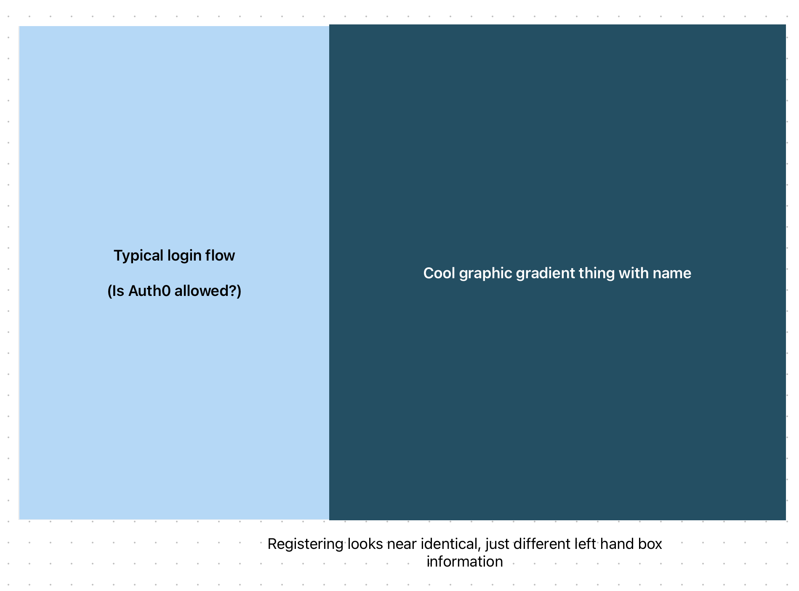
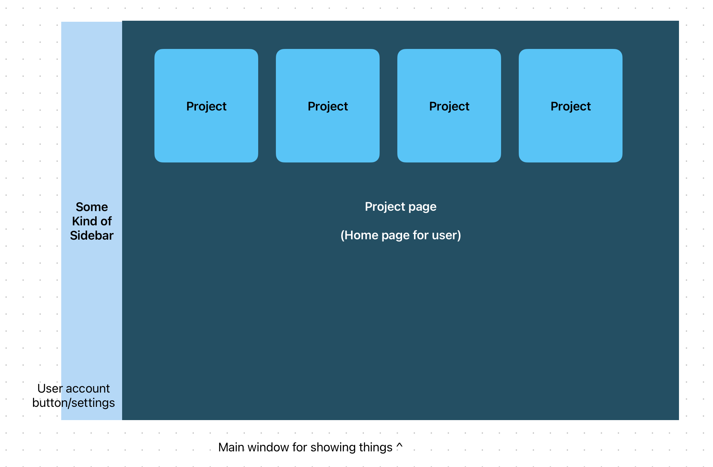
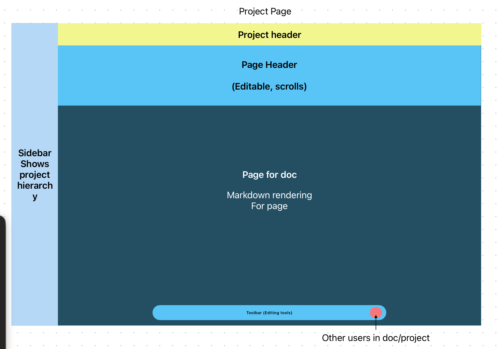
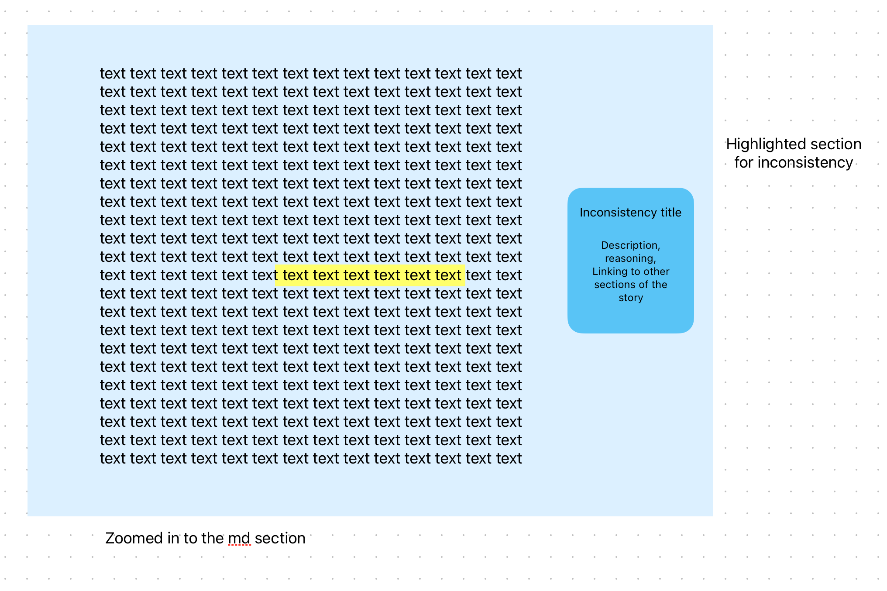

# CS 260 wip name

**Elevator Pitch**  

There are many websites that help people worldbuild, and write stories, however each have limited 
free tiers or no free tiers. I'm poor, so I have been writing in google docs which has some major limitations. 

This application will have better worldbuilding docs, which can be indexed and used while writing. For example, if you forget the name of a place, you will be able to do a inline search (like coding ides) to get it.

In addition AI will look for inconsistancies in character choices and behavior, and inconcisitancies in the story as well. It will not be writing anything for the story itself. The AI may be involved in the inline search, or be used for a natrual language search bar (unlikely).

## Key Features

- multiple projects
- worldbuilding docs (indexed)
- story (seperated by chapters in sidebar)
- automatic conversion to epub for viewing
- ai inconsistancy finder

## Technology Usage Specification

### HTML
creating the site, basic text/images without styling or layout

### CSS
Styling that will:
- create a modern feel
- create animations? (probably not)

### React
- Component-based architecture (Login, Project Page, Page, AI note, Profile, etc.)
- React Router for navigation between pages

### Web Service (Backend)
Node.js (Express?) server endpoints include:
- login/logout
- get-project-details
- get-page

### Integration with third-party API:  
Google Gemini api:
- look for inconsistancies in characters / story
- potentially create character roadmaps (could be hidden, used for ai prompting)
-- shows pivital character moments, stuff like that

### Database
PostgreSQL database to persistently store:
- User projects/pages
- User comments / AI editor suggestions
- User login information (if not using Auth0)

### WebSocket
Real-time communication using WebSockets for:
- Live updates from collaborators (?)
- Live feedback from AI editor 

## Design Mockups

### 1. Login / Register Screen

### 2. Project Page

### 3. Basic Page Layout

### 4. AI editor UI

