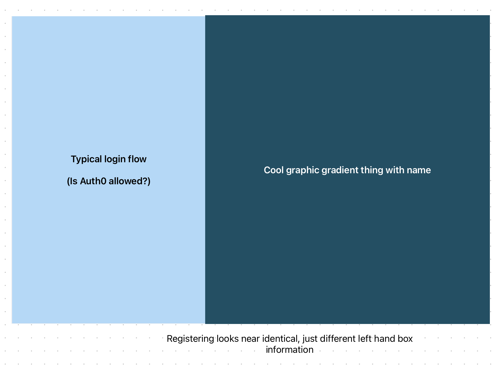
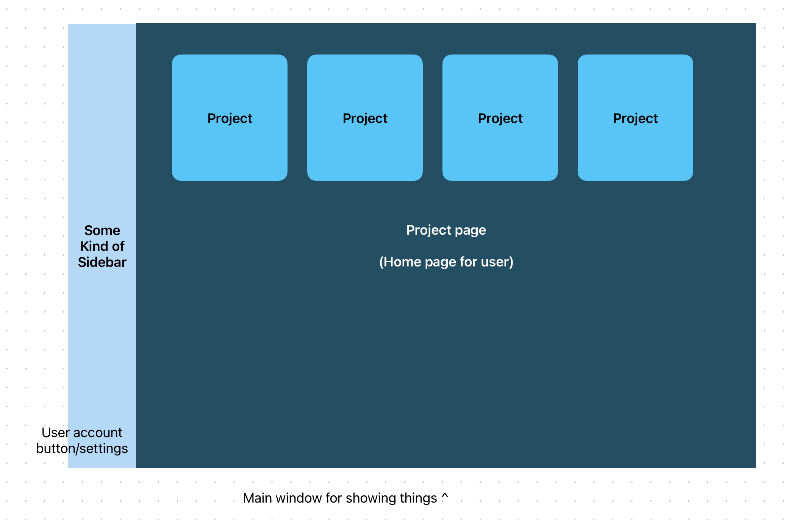
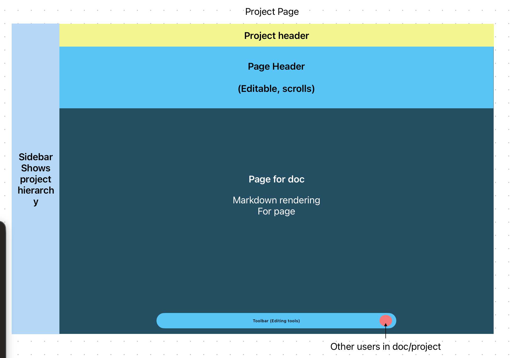
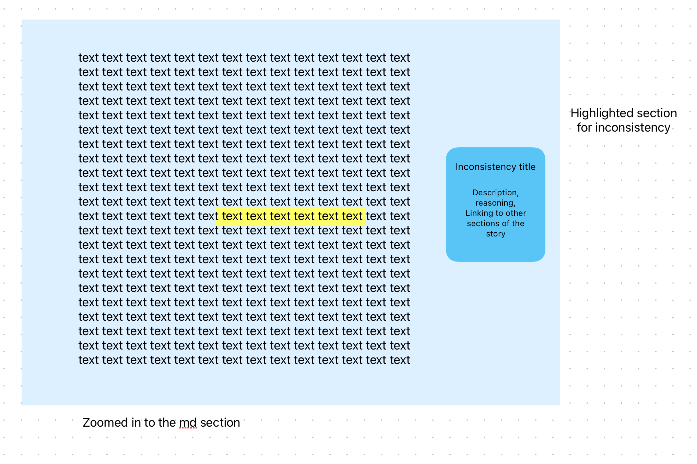

# CS 260 wip name

**Elevator Pitch**  

There are many websites that help people worldbuild, and write stories, however each have limited 
free tiers or no free tiers. I'm poor, so I have been writing in google docs which has some major limitations. 

This application will have better worldbuilding docs, which can be indexed and used while writing. For example, if you forget the name of a place, you will be able to do a inline search (like coding ides) to get it.

In addition AI will look for inconsistancies in character choices and behavior, and inconcisitancies in the story as well. It will not be writing anything for the story itself. The AI may be involved in the inline search, or be used for a natrual language search bar (unlikely).

## Key Features

- multiple projects
- worldbuilding docs (indexed)
- story (seperated by chapters in sidebar)
- automatic conversion to epub for viewing
- ai inconsistancy finder

## Technology Usage Specification

### HTML
creating the site, basic text/images without styling or layout

### CSS
Styling that will:
- create a modern feel
- create animations? (probably not)

### React
- Component-based architecture (Login, Project Page, Page, AI note, Profile, etc.)
- React Router for navigation between pages

### Web Service (Backend)
Node.js (Express?) server endpoints include:
- login/logout
- get-project-details
- get-page

### Integration with third-party API:  
Google Gemini api:
- look for inconsistancies in characters / story
- potentially create character roadmaps (could be hidden, used for ai prompting)
-- shows pivital character moments, stuff like that

### Database
PostgreSQL database to persistently store:
- User projects/pages
- User comments / AI editor suggestions
- User login information (if not using Auth0)

### WebSocket
Real-time communication using WebSockets for:
- Live updates from collaborators (?)
- Live feedback from AI editor 

## Design Mockups

### 1. Login / Register Screen

### 2. Project Page

### 3. Basic Page Layout

### 4. AI editor UI

## Updates for HTML Dummy
basic html for buttons, input areas, and ai suggestion interfaces added. 
basic styling as well to better see the formatting of everything

**used ai to generate dummy data cause i dont wanna do all that**

## HTML deliverable

For this deliverable I built out the structure of my application using HTML.

 I completed the prerequisites for this deliverable (Simon deployed, GitHub link, Git commits)
 HTML pages - Two HTML pages that represent the ability to login and view project.
 Proper HTML element usage - I just used div elements for everything. (and a nav)
 Links - The login page automatically links to the story page. the story page can change to be characters, props, etc.
 Text - because there will be many dynamic elements, there are some example chapters, chapter text etc. _this was ai gen, cause it wasnt important to the html_
 3rd party API placeholder - Placeholder for calls to gemini.
 Images - one image in the login page, otherwise images will be added by users to the docs
 DB/Login - Input box and submit button for login. no user database currently demoed, instead story, character, etc data is demoed
 WebSocket - just a console log for now, will show realtime user interaction though

in the future:
- login flow
- actual styling
- gemini api integration
  - hidden docs for gemini integration, mcp?
- PlateJS replacement for textareas
  - md to epub conversions??

## CSS Deliverable
Visually Appealing Layout: 
- used a color picking site to pick complimenting colors that i felt fit the project
- used flexbox for layout
CSS framework:
- pure.css for text areas, shoulda use this sooner
All elements were styled with css
window responsiveness is likely limited, 
imported font: Alegreya from google fonts
used multiple class and id selectors. media 

things to work on in the future:
- mobile styling specifically for chapter/character/etc selection, this app doesnt work great on mobile, but
navigating the page to see information should be a bit smoother.
- text area setup, when transfering to react, use a md text area equivalent.
- backend features

## React Part 1 Deliverable
- Multiple React components - Login, Account, Everything (main layout), Story, Characters, Locations, Props, History
- React Router - routes between login (`/`), project pages (`/everything/*`), and account (`/account`). nested routes under Everything for each section (story, characters, locations, props, history)
  - nested routes will become reactive in part 2
- Sidebar layout with NavLink for active styling, shared across all project/account pages using `<Outlet />`, could become reactive

## React Part 2 Deliverable
- All pages use reactive behaviors to update user inputs
- Consolidated pages into everything.jsx, using a shared function "EntryList" to keep track of chapters and chapter contexts.
- fixed attributes to render properly
- dummy login logic, currently no security on it though
- EntryList data is currently shared, not per user.
- UseState used to keep track of user input, use effect to asynchronously get data from dummy files.

## Service Deliverable
- Node.js/Express backend in `service/` directory with its own package.json
- Frontend served via Express static middleware in production
- Third party API: Gemini API (`@google/genai`) called from backend for AI story helper chat
- Backend endpoints:
  - Auth: `POST /api/auth/register`, `POST /api/auth/login`, `DELETE /api/auth/logout`
  - World data: `GET /api/world`, `PUT /api/world`
  - Account: `PUT /api/account`
  - Collaborators: `GET /api/collaborators`, `POST /api/collaborators`, `DELETE /api/collaborators/:name`
  - Edit log: `GET /api/edits`
  - AI search: `POST /api/search`
- Frontend calls all service endpoints via fetch in `backendCommunicator.jsx`
- Auth uses httpOnly cookie tokens, bcryptjs for password hashing
- Collaborator system: add other users to your world, shared world data saved across collaborators
- Server-side edit log shared across collaborators, displayed in Recent Edits tab
- Side panel with tabs for Recent Edits and AI Helper
- Vite proxy config routes `/api` to backend on port 4000 during development
- Restyled account page with two-column layout (account settings + collaborators)

## DB Deliverable
- MongoDB Atlas used for persistent storage, replacing in-memory `storage.js` with `database.js`
- Two MongoDB collections: `users` (accounts, passwords, tokens, world data, collaborators) and `editLogs` (per-user edit history)
- User registration and login credentials stored and retrieved from MongoDB using bcryptjs hashing
- Auth tokens stored as a field on the user document instead of a separate in-memory map
- World data (story, characters, locations, props, history) persisted in MongoDB per user
- Collaborator lists and shared world data saved/synced through MongoDB `$addToSet` and `$pull` operators
- Simon DB deployed to production environment

## Web Socket Deliverable
- WebSocket client connection established in `backendCommunicator.jsx` on frontend
- Real-time updates for collaborators: when one user makes an edit, a message is sent to the WebSocket server, which broadcasts it to all other connected clients for that world
- Edit messages have both a notification and update the actual world data in the frontend state
- WebSockets are used to show what users are currently on the story/world
- misc updates to ui, ai connection, and other various qol stuff
